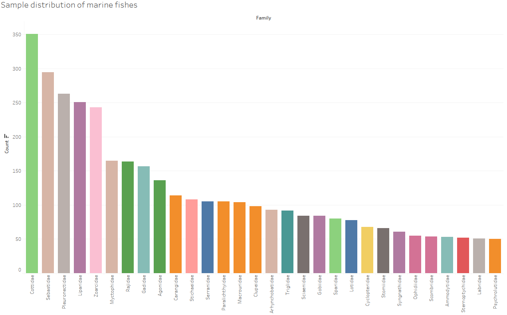
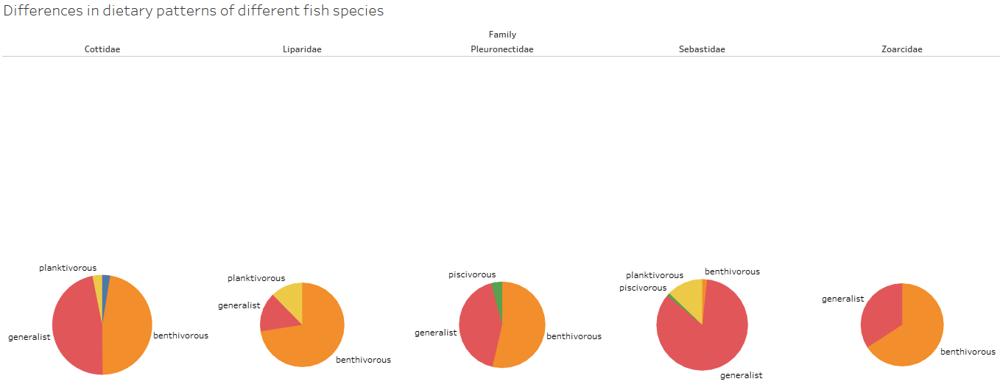
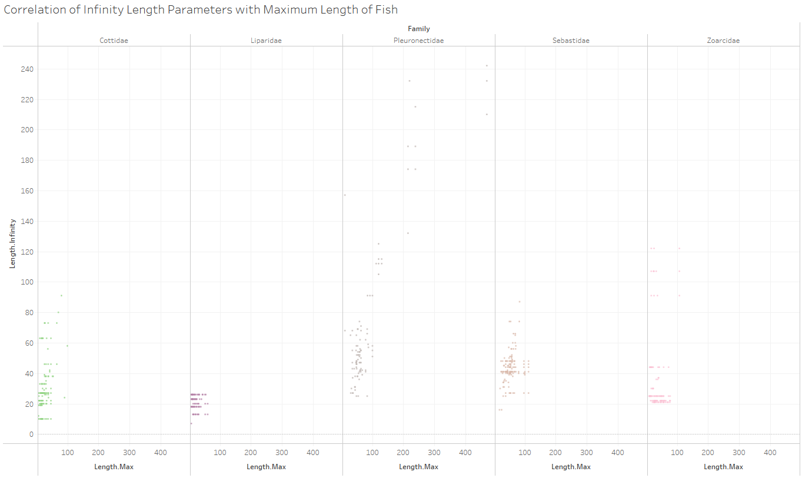

# Outline
Marine fish are valuable resources on which survival depends, and compared with freshwater fish, they have great differences in morphology, physiology and ecology. Marine fish are diverse and widely distributed, from the deep sea to the shallow sea, from the tropics to the frigid zone have their figure. They can not only drive the development of human marine economic industry, but also improve marine ecology. Analyzing the differences in attributes between different marine fishes can better designate more targeted conservation and intervention strategies for different categories of fishes effectively. The data visualization and analysis story of this project starts with the analysis of the attribute differences between different categories of fish in the North Atlantic and the East Pacific Ocean, further analyzes whether there are differences in growth coefficients estimated by the Von Bertalanffy equation for different categories of fish, and finally analyzes through visual graphs and charts whether the attribute differences are the essential cause of the differences in growth coefficients, and whether those attribute differences lead to growth coefficient variation in growth coefficients.
# Sketches

# Data
We chose for visualization and analysis the marine fish dataset Beukhof_2019, which explores the distribution of marine fishes in the continental shelf waters of the North Atlantic and the Northeast Pacific and the differences in attributes of different species. We provide an open source download link for the Beukhof_2019 dataset: [GitHub](https://doi.pangaea.de/10.1594/PANGAEA.900866)``.

This dataset contains character-based attributes as follows:
family,genus,species,taxonomic.rank,taxon,habitat,feeding.mode,body.shape,fin.shape,spawning.type.
Numerical type attributes are as follows: 
trophic.level,aspect.ratio,offspring.size,age.maturity,fecundity,length.infinity,growth.coefficient,length.max,age.max. 

These attributes record a variety of attribute data such as individual morphology, fecundity, habitat habit, foraging mode, etc. possessed by different subjects of fishes in the North Atlantic and Northeast Pacific waters. It reflects the multi-faceted characteristics of fishes from multiple perspectives.

In this visualization project, I hope to present these abstract attributes through a good visualization method. The data-driven format is also used to further explore the differences in attributes among different subjects of fishes.
# Method and medium
We begin with a histogram visualization to see the distribution of samples, and in order to give credibility to the data results, we will select a few of the fish species with the highest sample sizes for our analysis. We then utilize pie charts and other visualizations to show the differences in their attributes. Then, we utilize box plots to visualize the differences in growth coefficients. Finally, we try to see the correlation between growth coefficients and attribute differences through correlation analysis.

## Data Sources
Marine fish species from North Atlantic and Northeast Pacific continental shelf seas
Beukhof, E., Dencker, T. S., Palomares, M. L., & Maureaud, A. (2019). A trait collection of marine fish species from North Atlantic and Northeast Pacific continental shelf seas. Pangaea, 1, 12. https://doi.org/10.1594/PANGAEA.900866.
